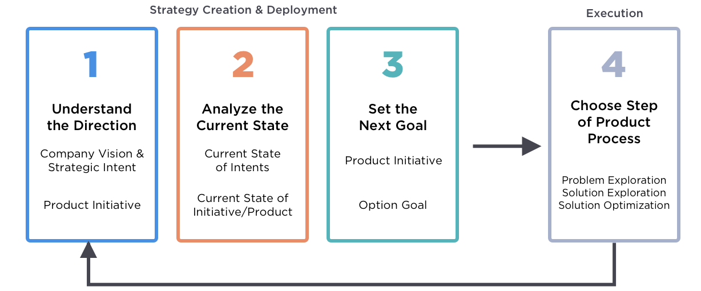
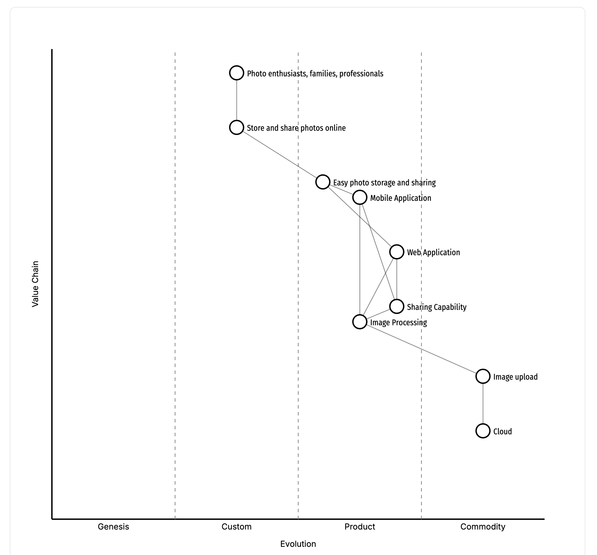
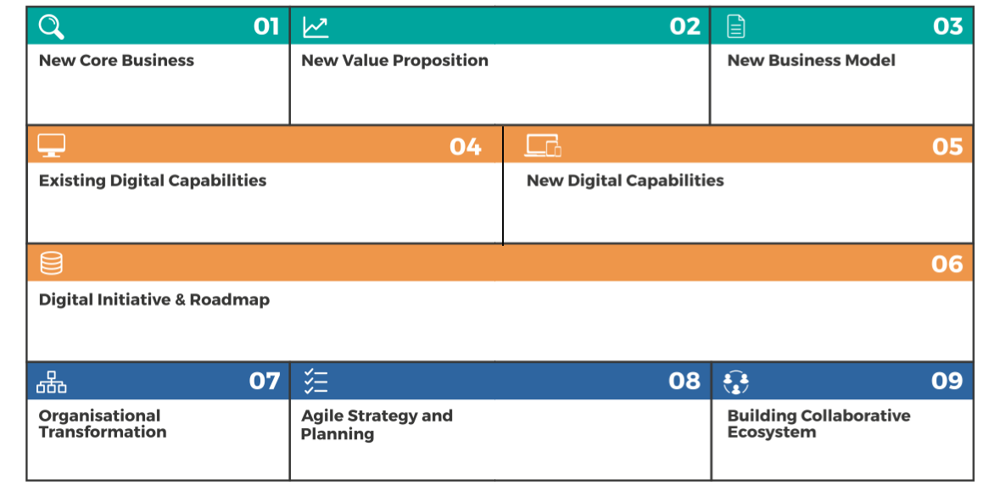
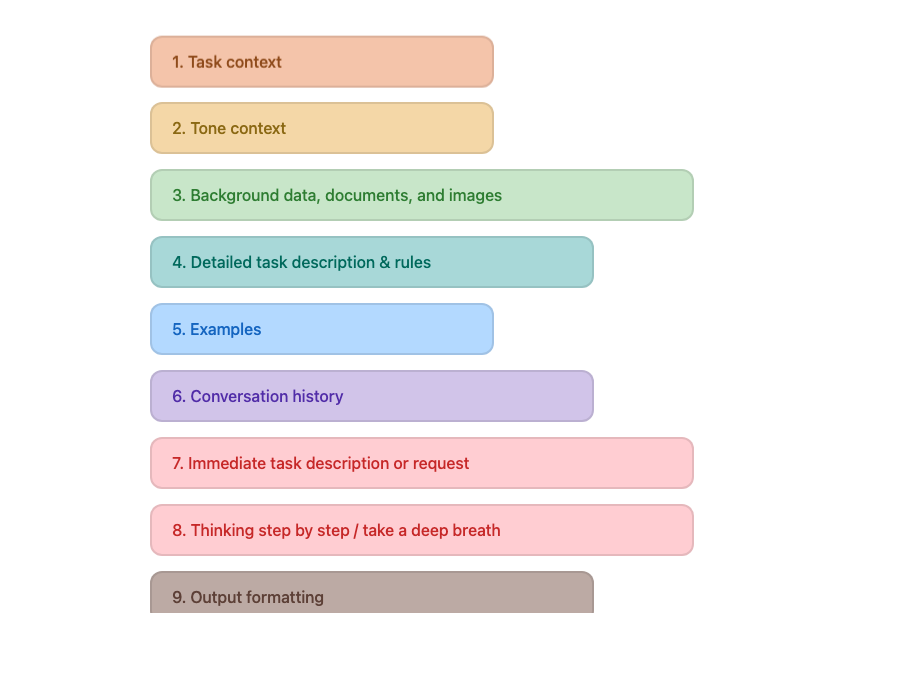

<!-- _class: lead
backgroundColor: white
color: #071652
-->

# Technologie Mobilne<br />w biznesie

<small style="font-size:25px">Wojciech Barczynski</small>

---

<!-- _class: lead -->

### Obecność

---

<!-- _class: lead
color: #000
colorSecondary: #333
backgroundColor: #fff
-->
## Agenda

1. Jak wygląda Mobile w 2025/2026?
2. Ewolucja modeli Biznesowych
3. Strategia i Product Management
4. Architektura Wyboru
5. Metryki i KPI
6. Governance: Bezpieczeństwo i Etyka Danych
7. Praca w grupach

---
<!-- _class: lead -->
## Mobile First

- Projektuj najpierw dla mobile, potem dla desktop
- Responsive Web Design (RWD) od najmniejszego ekranu
- "There's an app for that" - aplikacja na wszystko
- Wzrost ruchu mobilnego > desktop

---
<!-- _class: lead -->
## Mobile First - Konsekwencje

- Uproszczony UX (mały ekran = mniej opcji)
- Progressive Enhancement
- Aplikacje natywne jako główny kanał dystrybucji
- App Store / Google Play jako gatekeeperzy

---
<!-- _class: lead -->
## Mobile First - B2B

- Enterprise App Stores (MDM: Intune, Jamf, VMware)
- Companion apps - szybkie akcje w terenie
- BYOD (Bring Your Own Device) vs Corporate devices
- Integracja z ERP/CRM (Salesforce, SAP)
- Offline-first dla pracowników terenowych

---
<!-- _class: lead -->
## Co się zmieniło? (2025/2026)

| Mobile First | Nowe podejście |
|--------------|----------------|
| Zdobywaj instalacje | Retention-first |
| Buduj aplikację | Buduj ekosystem |
| UX dla mobile | AI-assisted UX |
| Aplikacja = produkt | Aplikacja = interfejs do AI |

---
<!-- _class: lead -->
## Od Mobile First do AI-Native

- **2010-2024**: Mobile First - projektuj od mobile
- **2025**: AI-Assisted - AI wspomaga użytkownika
- **2026+**: AI-Native - AI jako rdzeń produktu

&rarr; Mobile staje się jednym z wielu interfejsów do AI

<small>Źródła: [Stanford AI Index 2025](https://hai.stanford.edu/ai-index/2025-ai-index-report), [Gartner Hype Cycle](https://www.gartner.com/en/articles/what-s-new-in-artificial-intelligence-from-the-2024-gartner-hype-cycle)</small>

---
<!-- _class: lead -->
## Aplikacja = interfejs do AI

Strategia:

- Najpierw API, które może być konsumowane przez Mobile App i agentów AI

---
<!-- _class: lead -->
## Zachowania użytkowników

- Scarcity of attention
- Niska lojalność użytkowników (high churn)
- Wysokie oczekiwania, pierwsze uruchomienia kluczowe dla utrzymania użytkownika

<!-- https://hbr.org/2014/10/the-value-of-keeping-the-right-customers -->

---
<!-- _class: lead -->
## Mobile Trends in 2026

Retention-first:

- Maksymalizacja LTV
- Minimalizacja Time to Value
- AI obniża próg wejścia w aplikację (onboarding, nie tylko dokumentacja)

<!-- small>źródlo: <a href="https://www.saastr.com/in-the-age-of-ai-onboarding-and-time-to-value-should-be-the-1-goal-for-customer-success/">SaaSTr</a></small -->
<!-- https://www.saastr.com/in-the-age-of-ai-onboarding-and-time-to-value-should-be-the-1-goal-for-customer-success/  -->

---
<!-- _class: lead -->
## AI-Native + Retention-first

| Wymiar | Koncepcja | Pytanie |
|--------|-----------|---------|
| **Architektura** | AI-Native | *Jak* budujemy produkt? |
| **Strategia** | Retention-first | *Po co* budujemy produkt? |

**Synergia:** AI-Native umożliwia Retention-first

- AI personalizuje onboarding → szybszy Time to Value
- AI redukuje friction → wyższy DAU/MAU
- AI przewiduje churn → proaktywna retencja

---
<!-- _class: lead -->
## Case Study: Duolingo

**Problem:** Brak realnej praktyki konwersacyjnej w nauce języków

**Rozwiązanie AI-Native:**
- GPT-4 integration → "Roleplay" (konwersacje z AI)
- "Explain My Answer" → personalizowane wyjaśnienia błędów
- 100% automatyzacja tworzenia treści

---
<!-- _class: lead -->
## Case Study: Duolingo - Wyniki

| Metryka | 2024 | 2025 | Wzrost |
|---------|------|------|--------|
| DAU | 37M | 48M | +40% |
| Płatni subskrybenci | 8.6M | 10.9M | +47% |
| Przychód kwartalny | $193M | $252M | +41% |

**Marża brutto: 73%** (top w edtech)

<small>Źródło: Duolingo Q2 2025 Earnings</small>

---
<!-- _class: lead -->
## Case Study: Uber - AI fundamentem działania

| Obszar | Mechanizm AI | Rezultat |
|--------|--------------|----------|
| Matching | DeepETA prediction | Niższe anulacje |
| Pricing | Reinforcement Learning | Stabilność rynku |
| Safety | Computer Vision | Proaktywne wykrywanie ryzyk |
| Support | NLP klasyfikacja | Automatyzacja reklamacji |

<small>Źródło: [DigitalDefynd 2026](https://digitaldefynd.com/IQ/uber-using-ai-case-study/), [Uber Newsroom](https://www.uber.com/newsroom/onlyonuber25/)</small>

---
<!-- _class: lead -->
## Case Study: WeChat (Super App)

**1.48 mld MAU** | **$60 mld wycena** | **79 min/dzień użycia**

| Funkcja | Skala | Model |
|---------|-------|-------|
| Mini Programs | 945M MAU | Platforma dla 3rd party |
| WeChat Pay | $15T transakcji/rok | Komisja od płatności |
| WeChat Work | 65M firm | Enterprise SaaS |
| Moments (social) | 780M DAU | Reklamy |

<small>Źródło: [Statista 2025](https://www.statista.com/topics/9085/wechat/), [Awisee](https://awisee.com/blog/wechat-statistics/)</small>

---
<!-- _class: lead -->
## Case Study: Wnioski

| Firma | Lekcja |
|-------|--------|
| Duolingo | AI jako rozwiązanie konkretnego problemu |
| Uber | AI buduje ekosystem zaufania i bezpieczeństwa |
| WeChat | Super App: platforma > pojedyncza funkcja |
|  | Product-Led Growth napędzany technologią |

---
<!-- _class: lead -->
## Płatne instalacje: iOS vs Android (2025)

| Rynek     | iOS    | Android |
|-----------|--------|---------|
| USA       | +31%   | +8%     |
| UK        | +64%   | +1%     |
| Kanada    | +80%   | -       |
| Australia | -      | -9%     |

źródło: [AppsFlyer 2025](https://www.appsflyer.com/resources/reports/top-5-data-trends-report/)

---
<!-- _class: lead -->
## VC - iOS vs. Android

*Investment is surging in iOS ($53B non-gaming spend in 2025) due to its high-intent, high-LTV user base, while Android remains the laboratory for "Super Apps."*

---
<!-- _class: lead -->
## Modele biznesowe w erze AI

<!-- https://gemini.google.com/app/22f6caadf83ad557?hl=pl -->

---
<!-- _class: lead -->
#### Modele Biznesowe przed 2025

| Model ([źródło](https://cisr.mit.edu/publication/whats-your-digital-business-model)) | Mechanizm                          | Przykład                           |
|-------------------|------------------------------------|------------------------------------|
| Supplier          | Sprzedaż przez pośredników         | Producent, ubezpieczyciel          |
| Omnichannel       | Łączy kanały cyfrowe i fizyczne    | Retail, bankowość                  |
| Modular Producer  | Plug-and-play usługi               | Dostawca płatności (Stripe)        |
| Ecosystem Driver  | Platforma wokół domeny klienta     | Zakup domu, zarządzanie energią    |

---
<!-- _class: lead -->
#### Modele Biznesowe z AI 2025+

| Model ([źródło](https://cisr.mit.edu/publication/2025_1001_BizModelsAIEra_WeillSebastianWoernerBenedict))            | Mechanizm                          | Efekt                              |
|-------------------|------------------------------------|------------------------------------|
| Existing+         | AI wzbogaca istniejący model       | Lepsza efektywność                 |
| Customer Proxy    | AI realizuje cele za użytkownika   | Autonomiczne zarządzanie           |
| Modular Curator   | Składanie modułów w pakiety        | Szybka personalizacja oferty       |
| Orchestrator      | Ekosystem produktów sterowany AI   | W pełni zarządzane rozwiązania     |

---
<!-- _class: lead -->


<!--
https://www.saastr.com/the-6-threat-vectors-killing-traditional-b2b-software-in-2026-and-how-to-fight-back/
--->

---
<!-- _class: lead -->
## Dużo zmian, wysoka niepewność

Jak z tym pracować?

- Strategia, narzędzia i product management
- Nie próbuj przewidzieć wszystkiego
- Małe eksperymenty, szybkie iteracje
- Bottom-up innovation!

---
<!-- _class: lead -->
#### Strategic Intent

| Intencja                                      | Cel                                                                 |
|-----------------------------------------------|---------------------------------------------------------------------|
| Wejście na rynek korporacyjny                 | Zwiększenie przychodu z 5 mln do 60 mln USD w ciągu 3 lat           |
| Podwojenie wzrostu przychodów od użytkowników indywidualnych | Zwiększenie wzrostu przychodów z 15% r/r do 30% r/r od użytkowników indywidualnych |

<small>Perri, M. (2019). Escaping the build trap. O'Reilly Media, Inc.</small>

---
<!-- _class: lead -->
#### Strategic Intent &rarr; Product Inicjatywy


<small>Perri, M. (2019). Escaping the build trap. O'Reilly Media, Inc.</small>

---
<!-- _class: lead -->
#### Product Management



<small>Perri, M. (2019). Escaping the build trap. O'Reilly Media, Inc.</small>


---
<!-- _class: lead -->
#### Metrics


- North star metric (*messages per month*) - ile wartości dostarczamy
- Business Value metric (*seats sold*) - ile wartości dostajemy w zamian

---
<!-- _class: lead -->
#### Product Management

Warto przeczytać:

- Perri, M. (2019). Escaping the build trap. O'Reilly Media, Inc.
- Itamar Gilad (2023), Evidence-Guided: Creating High Impact Products in the Face of Uncertainty.
- Książki Martiego Cagana - inspirujące, ale mało konkretów do wdrożenia

---
<!-- _class: lead -->
#### Bottom-up innovation

- Hackathony
- Skracanie dystansu zespołu do klienta
- Kultura proaktywności

---
<!-- _class: lead -->
#### Wardley Mapping

- strategiczne framework stworzone przez [Simona Wardleya](https://www.wardleymaps.com).
- strategiczna technika wizualizacji, która pomaga liderom zobaczyć swój łańcuch wartości, przewidywać zmiany i wyprzedzać konkurencję.
- co jest naszą przewagą konkurencyjną?

---
<!-- _class: lead -->
#### Wardley Mapping

<div style="display: flex; align-items: center;">
<div style="flex: 1;">

[Przyklad](https://www.wardleymaps.com/guides/wardley-mapping-101)

</div>
<div style="flex: 1;">



</div>
</div>

---
<!-- _class: lead -->
#### Wardley Mapping

Przeczytaj - [mapping 101](https://www.wardleymaps.com/guides/wardley-mapping-101)

---
<!-- _class: lead -->

### BATL Framework

| Element                  | Opis |
|--------------------------|------------------------------------------------------------------------------------------------------------------------------------------|
| Benefits (Korzyści)      | Ocena wartości dodanej (wymiernej i niewymiernej), jaką inicjatywa generuje dla głównego biznesu poza samym zwrotem finansowym. |
| Assets (Zasoby)          | Opis niematerialnych i niepieniężnych zasobów posiadanych przez główny biznes, które mogą zostać wykorzystane przez nową inicjatywę. |

<small>Stanford Graduate School of Business (GSB)</small>

<!-- https://gemini.google.com/app/2027e479166ce320?hl=pl -->

---

<!-- _class: lead -->

### BATL Framework

| Element                    | Opis |
|----------------------------|------------------------------------------------------------------------------------------------------------------------------------------|
| Threats (Zagrożenia)       | Opis ryzyk, na jakie nowa inicjatywa może narazić główną działalność firmy. |
| Liabilities (Ograniczenia) | Opis restrykcji i ograniczeń, jakie główny biznes może nałożyć na nową inicjatywę, utrudniając jej odniesienie sukcesu. |

<small>Stanford Graduate School of Business (GSB)</small>

<!-- 
https://online.hbs.edu/blog/post/ai-native
https://www.uxtigers.com/post/ai-first
-->

---

<!-- _class: lead -->

#### Digital Transformation Canvas



<small><a href="https://www.digitaltransformationcanvas.com/canvas">dtc</a></small>

---

<!-- _class: lead -->

#### Inne narzędzia

- Algorithmic Business Thinking - dekomozycja
- Value Stream Mapping - wizualizacja przepływu wartości
- Event storming - wizualizacja procesów biznesowych poprzez wspólne mapowanie zdarzeń domenowych

---
<!-- _class: lead -->
## Mobile w Strategii Cyfrowej

```
CORPORATE STRATEGY
│ "Wzrost przychodów +15% r/r"
│
└─ DIGITAL STRATEGY
   │ "Omnichannel, data-driven operations"
   │
   └─ MOBILE STRATEGY
      │ "Mobile revenue 30%, engagement +50%"
      │
      └─ APP ROADMAP
         t1: MVP → t2: AI → t3: Scale
```

---
<!-- _class: lead -->
## Omnichannel Architecture

```
        KANAŁY                    BACKEND (Unified)
┌─────────────────┐         ┌────────────────────-─┐
│ Web (desktop)   │────────▶│ Customer Profile 360 │
│ Mobile App      │────────▶│ Inventory            │
│ In-store kiosk  │────────▶│ Pricing Engine       │
│ AI Agents       │────────▶│ Analytics            │
└─────────────────┘         └─────────────────────-┘
                                     │
                              ┌──────▼──────┐
                              │  DATA LAKE  │
                              │  CDP + AI   │
                              └─────────────┘
```

**Klucz:** Jeden backend, wiele interfejsów

---
<!-- _class: lead -->
## Od Strategii do Implementacji

Model biznesowy określa **dlaczego** i **co** budujemy.

Teraz przejdzmy **jak** to zbudować.

| Pytanie strategiczne | Decyzja techniczna |
|---------------------|-------------------|
| Jak szybko na rynek? | No-Code vs Native |
| Jaki budżet? | Cross-platform vs Native |
| Gdzie przewaga konkurencyjna? | Build vs Buy |

---
<!-- _class: lead -->
## Build vs Buy vs Partner

| Pytanie | Odpowiedź | Decyzja |
|---------|-----------|---------|
| Czy to nasza przewaga konkurencyjna? | Tak | **Build** |
| Czy SaaS robi 80% tego co potrzebujemy? | Tak | **Buy** |
| Potrzebujemy platformy + customizacji? | Tak | **Partner** |

---
<!-- _class: lead -->
## Build vs Buy vs Partner

Przykłady:

- BUILD: Uber zbudował własny system płatności
- BUY: Większość firm kupuje PagerDuty do monitoringu
- PARTNER: Enterprise ERP (SAP + Deloitte)

---
<!-- _class: lead -->
### Technologie dla Aplikacji

- No-Code (wczesne MVP)
- Cross-platforms:

  - React Native (bezpieczny wybór)
  - Flutter (startup)

- Natywny (bezpieczny wybór)

---
<!-- _class: lead -->
### Porównanie

| Cecha              | No-Code       | Flutter           | React Native    | Native        |
|--------------------|---------------|-------------------|-----------------|---------------|
| Dostęp progamistów | -             | Niski/Średni      | Bardzo wysoki   | Wysoki        |
| Koszt rozwoju      | Niski         | Średni            | Średni          | Wysoki        |
| Koszt utrzymania   | Niski         | Niski/Średni      | Niski/Średni    | Wysoki        |
| Time-to-Market     | Bardzo Szybki | Szybki            | Szybki          | Długi         |

---
<!-- _class: lead -->
### Porównanie

| Cecha       | No-Code     | Flutter         | React Native        | Native        |
|-------------|-------------|-----------------|---------------------|---------------|
| Ekosystem   | Ograniczony | Średni          | Bardzo Duzy         | Bardzo Duzy   |
| Wydajność   | Słaba       | Wysoka* (AOT)   | Wysoka (Bridge/JSI) | Najwyższa     |
| UX / UI     | Szablonowe  | Idealnie spójne | Jak Natywne         | Perfekcyjne   |

---
<!-- _class: lead -->
### Porównanie

| Development Approach     | Upfront Cost (2025/26)     |  Best Use Case                       |
|--------------------------|----------------------------|--------------------------------------|
| Native (Swift/Kotlin)    | $55,000 - $500,000+        | High-perf gaming, AR/VR, Fintech     |
| Cross-Platform (Flutter, React Native) | $25,000 - $60,000+  |  E-commerce, MVPs, Retail            |
| Low-Code / No-Code       | Project-based / SaaS       | Internal tools, simple workflows     |

---
<!-- _class: lead -->
### Backend dla Mobile

| Opcja | Przykłady | Kiedy wybrać? |
|-------|-----------|---------------|
| **BaaS** | Firebase, Supabase | MVP, szybki start |
| **Serverless** | AWS Lambda, Vercel | Skalowanie, pay-per-use |
| **Custom** | Node.js, Go | Pełna kontrola, przewaga |

Trend 2026: BaaS + AI APIs (OpenAI, Anthropic)

---
<!-- _class: lead -->
### Nie wszystko trzeba samemu budować

- API-first CRM
- API-first ecommerce
- ...
- Feature-flags

---
<!-- _class: lead -->
## Metryki

---
<!-- _class: lead -->
## Metryki Biznesowe

| Metryka | Opis | Benchmark |
|---------|------|-----------|
| LTV (Lifetime Value) | Wartość klienta w cyklu życia | LTV > 3 × CAC |
| CAC (Customer Acquisition Cost) | Koszt pozyskania użytkownika | iOS 2026: rekordowo wysoki |
| Retention Rate (D30/D90) | % użytkowników po 30/90 dniach | D30: 5-10%, D90: 2-5% |
| Stickiness (DAU/MAU) | Stosunek dziennych do miesięcznych | >25% = "nawyk" |

---
<!-- _class: lead -->
## Metryki Biznesowe

- **LTV vs CAC**: W 2026 kluczowe śledzenie LTV w podziale na kanały (w tym AI)
- **Retention First**: 80% przychodu generuje 20% obecnych klientów
- **Stickiness Ratio**: Jeśli DAU/MAU > 25%, aplikacja jest częścią nawyków użytkownika

---
<!-- _class: lead -->
## Metryki AI (Efektywność Agentów)

Dla aplikacji z asystentem AI lub agentami autonomicznymi:

| Metryka | Opis | Target |
|---------|------|--------|
| Task Success Rate (TSR) | % zadań ukończonych bez interwencji | > 80% |
| Inference Latency | Czas odpowiedzi AI | < 1s mobile, < 2s web |
| Token Cost per User | Koszt LLM na użytkownika | < $0.10/sesja |

---
<!-- _class: lead -->
## Dashboard / KPI

| Metryka | Co mówi o biznesie? | Cel (Benchmark) |
|---------|---------------------|-----------------|
| ARPU | Średni przychód na użytkownika | Wzrost r/r o min. 10% |
| Churn Rate | Jak szybko tracisz klientów | < 5% miesięcznie |
| Onboarding Completion | Czy proces wejścia jest intuicyjny | > 70% |
| NPS (In-App) | Satysfakcja mierzona wewnątrz aplikacji | > 50 |

plus metryki *North Star* i *Top Business*

---
<!-- _class: lead -->
# Governance: Bezpieczeństwo i Etyka Danych

---
<!-- _class: lead -->
## Compliance w Mobile Apps

| Regulacja | Wymaganie | Konsekwencje |
|-----------|-----------|--------------|
| **GDPR** (EU) | Consent, Right to be Forgotten | Do €20M lub 4% revenue |
| **CCPA** (California) | Opt-out, Data Disclosure | $7,500/naruszenie |
| **App Store / Google Play** | Privacy Labels, ATT | Odrzucenie aplikacji |

**Privacy by Design** - nie addon, ale fundament architektury

<!-- 
---
## Security Checklist

- [ ] Encryption in transit (TLS 1.3)
- [ ] Data at rest encryption (AES-256)
- [ ] Certificate pinning
- [ ] Secure storage (Keychain/Keystore)
- [ ] Penetration testing (OWASP Mobile Top 10)
- [ ] Third-party library audit (SCA)
-->

---
<!-- _class: lead -->
## Etyka AI w Mobile

| Ryzyko | Przykład | Mitygacja |
|--------|----------|-----------|
| **Bias** | Dyskryminacja w scoringu | Audyt modeli, diverse training data |
| **Transparency** | "Black box" decyzje | Explainable AI (XAI) |
| **Privacy** | Profilowanie użytkowników | Data minimization, on-device AI |
| **Manipulation** | Dark patterns, uzależnienie | Ethical design review |

---
<!-- _class: lead -->
## Etyka AI w Mobile


<small><a href="https://github.com/fastai/fastbook/blob/master/02_production.ipynb">fastbook</a></small>

---
<!-- _class: lead -->

## Key Takeaways

1. **Od Mobile First do AI-Native** - aplikacja mobilna staje się interfejsem do AI
2. **Retention > Acquisition** - utrzymanie użytkownika jest tańsze niż pozyskanie nowego

---
<!-- _class: lead -->

## Key Takeaways

3. **Wybór architektury = decyzja biznesowa** - No-Code dla MVP, Native dla przewagi
4. **Metryki są kluczowe** - LTV/CAC > 3:1, DAU/MAU > 25% = nawyk
5. **Eksperymentuj** - małe testy, szybkie iteracje, bottom-up innovation

---
<!-- _class: lead -->

## Pytania?


[github.com/wojciech11](https://github.com/wojciech11/)

---

<!-- _class: lead -->

## Backup Slides

---
<!-- _class: lead -->
## DORA metrics

- Jak mam wiedzieć, że dział inż. nie ma problemów

---
<!-- _class: lead -->
## DORA Metrics - 4 Kluczowe Wskaźniki

| Metryka | Opis | Elite Performance |
|---------|------|-------------------|
| **Deployment Frequency** | Jak często deployujemy na produkcję | On-demand (wiele razy dziennie) |
| **Lead Time for Changes** | Czas od commita do produkcji | < 1 godzina |
| **Change Failure Rate** | % deployów powodujących incydenty | < 5% |
| **Time to Restore Service** | Czas naprawy po awarii | < 1 godzina |

<small>Źródło: [DORA Research](https://dora.dev/guides/dora-metrics/)</small>

---
<!-- _class: lead -->
## Kano model

- [kano model](https://en.wikipedia.org/wiki/Kano_model)

---
<!-- _class: lead -->
## Eksperci lepiej sobie radzą

- Domain oriented:  https://cisr.mit.edu/publication/2023_0901_DomainOriented_WeillWoerner

---
<!-- _class: lead -->
## SaaStr

- https://www.saastr.com/in-the-age-of-ai-onboarding-and-time-to-value-should-be-the-1-goal-for-customer-success/ 
- https://www.saastr.com/the-6-threat-vectors-killing-traditional-b2b-software-in-2026-and-how-to-fight-back/

---
<!-- _class: lead -->
## Standford 

- AI Index Report:<br />https://hai.stanford.edu/ai-index/2025-ai-index-report
- Emerging Tech:<br />https://setr.stanford.edu/technology-areas-2025

---
<!-- _class: lead -->
## Thoughtworks radar

https://www.thoughtworks.com/radar

---

# Algorithmic Business Thinking (ABT)

## Nowoczesne podejście do rozwiązywania problemów

**Łączenie logiki maszynowej z ludzką intuicją**

---

## Czym jest Algorithmic Business Thinking?

* **Definicja:** Ramy myślowe łączące kreatywność biznesową z ustrukturyzowaną logiką komputerową.
* **Cel:** Przekształcenie złożonych wyzwań w skalowalne procesy.
* **Kluczowa zmiana:** Przejście od decyzji opartych na intuicji do decyzji wspieranych przez dane i algorytmy.

> "Nie musisz być programistą, aby myśleć jak architekt systemów."

---

## 4 Filary Metodologii ABT

1. **Dekompozycja**
   Rozbijanie wielkich problemów na mniejsze, atomowe części.
2. **Rozpoznawanie wzorców**
   Szukanie trendów i powtarzalnych zachowań w danych.
3. **Abstrakcja**
   Oddzielanie kluczowych sygnałów od informacyjnego szumu.
4. **Projektowanie algorytmów**
   Tworzenie logicznych sekwencji kroków (workflow).

---

## Integracja: Dane, Algorytmy i Ludzie

Wykorzystanie ABT wymaga balansu w tzw. **Złotym Trójkącie**:

- **Dane:** Fundament i paliwo dla procesów.
- **Algorytmy:** Narzędzia do automatyzacji i optymalizacji.
- **Ludzie:** Nadzór etyczny, zadawanie pytań i empatia.

---

## Korzyści z wdrożenia ABT

* **Skalowalność:** Procesy stają się powtarzalne i łatwe do powielenia.
* **Obiektywizm:** Redukcja "błędów poznawczych" w zarządzaniu.
* **Szybkość:** Błyskawiczna analiza ogromnych zbiorów danych (Big Data).
* **Innowacyjność:** Uwolnienie czasu pracowników od żmudnych zadań.

---

## Przykłady zastosowań (Use Cases)

| Obszar | Zastosowanie ABT |
| :--- | :--- |
| **Marketing** | Hiper-personalizacja ofert w czasie rzeczywistym. |
| **Logistyka** | Optymalizacja łańcucha dostaw i predykcja braków. |
| **HR** | Algorytmiczne wsparcie selekcji talentów. |
| **Finanse** | Automatyczne systemy antyfraudowe. |

---

## Podsumowanie: Mindset Lidera ABT

- **Zrozumienie technologii:** Wiedza o tym, *co* algorytm może zrobić, a nie tylko *jak* jest napisany.
- **Most kompetencyjny:** ABT łączy świat technologii (IT) ze światem biznesu.
- **Strategia:** Automatyzuj to, co przewidywalne – personalizuj to, co wyjątkowe.


---
<!-- _class: lead -->
## Three pilars  of a Mobile Business Model

Not just as "making money," an abstract description of the business consisting of 3 essential parts:

- Value Proposition: What is the specific benefit for the customer? In 2026, this focuses on Context-Sensitivity (we know where you are and what you need) and Personal Sphere (the device as an extension of the self).

- Value Creation Architecture: How is the benefit generated? This involves mapping the stakeholders—from Mobile Network Operators (MNOs) to Content Providers and AI service layers.

- Revenue Model: Where does the money come from? It distinguishes between direct (subscriptions) and indirect (advertising/data) streams.

---

<!-- _class: lead -->

## Models

- Anthropic models lead
- `claude` &#8594; better results
- [Cut-off](https://docs.anthropic.com/en/docs/about-claude/models/overview) - march 2025

---

<!-- _class: lead -->

## Prompt for Claude Code

- The CO-STAR and CLEAR Framework
- Keywords, e.g., exactly, detailed, [...](https://github.com/wojciech12/notes_ai_for_software_engineering/blob/main/PROMPTS.md)
- Role-task format pattern

  ```
  You are a [ROLE] with expertise in [DOMAIN].
  Your task is to [SPECIFIC_ACTION].
  ```

---

<!-- _class: lead -->

## The CO-STAR Framework

- **C**ontext: Background information
- **O**bjective: The purpose or goal
- **S**tyle: Formal, informal, etc.
- **T**one: Friendly, authoritative
- **A**udience: for whom it is
- **R**esponse Format: output

---

<!-- _class: lead -->

## The CLEAR Framework

- **C**oncise: Be brief and to the point.
- **L**ogical: Structure your prompt in a logical order.
- **E**xplicit: State exactly what you want.
- **A**daptive: Frame the prompt to be adaptable to different scenarios.
- **R**ole-based: Assign a role to the AI.

---

<!-- _class: lead -->



Will help:

- Good to watch 1-2 videos about prompt engineering
- [prompt optimizer](https://docs.anthropic.com/en/docs/build-with-claude/prompt-engineering/prompt-improver) at claude.ai
- Claude can review your prompts as well.

---

<!-- _class: lead -->

# Prompt Engineering

- [Prompt Best Practices](https://docs.anthropic.com/en/docs/build-with-claude/prompt-engineering/be-clear-and-direct)
- [Prompt library](https://docs.anthropic.com/en/resources/prompt-library/corporate-clairvoyant)
- [CO-STAR](https://towardsdatascience.com/how-i-won-singapores-gpt-4-prompt-engineering-competition-34c195a93d41/)- [Article on prompting](https://library.westpoint.edu/GenAI/prompting)
